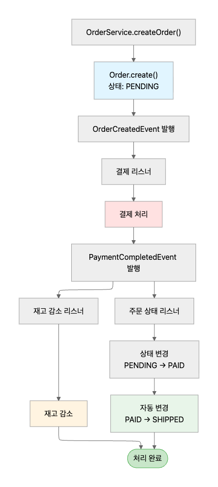

# 🚀 이벤트 리스너 기반 이벤트 처리

## 이벤트 플로우 다이어그램
주문 생성부터 완료까지의 이벤트 처리 흐름입니다.



---
## 실행 방법

### 🐳 Docker 환경 구성

프로젝트 루트 디렉터리에서 Docker Compose를 실행하여 필요한 인프라를 시작합니다.
```bash
# Docker Compose로 인프라 실행 - Postgres 설정 및 데이터 베이스 생성
docker-compose up -d

# 컨테이너 상태 확인
docker-compose ps
```

### 🏃🏼 실행 방법
### 

```bash
# jar 파일 생성
 ./gradlew :order-service:clean :order-service:build
# 실행
 ./gradlew :order-service:bootRun --args='--spring.profiles.active=test'
# 테스트 실행
 ./gradlew :order-service:test      
```

### 회고

이벤트 기반 아키텍처를 도입하면서 비동기 처리의 양면성을 경험했습니다. 사용자 응답 속도는 크게 개선되었지만, 비동기 테스트 코드 작성의 어려움과 멀티 스레드 환경에서의 디버깅 복잡도가 예상보다 높았습니다. 특히 각 이벤트 단계별 실패 시나리오에 대한 보상 트랜잭션과 재시도 로직을 설계하는 과정에서 분산 시스템의 복잡성을 체감할 수 있었습니다.
