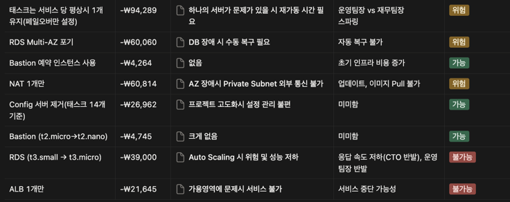
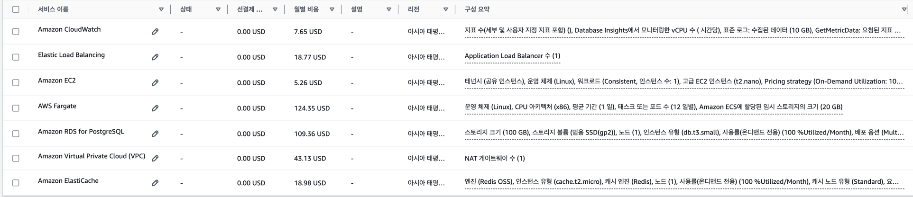

# ARCHITECTURE_DESIGN

## 기술 요구사항 분석

### 운영팀장 요구사항

> 장애 발생 시 자동 복구

- grafana로 감지 후 알림(현재 그라파나만 붙어있는 상태고, 해당 설정을 추가하는 것으로 계획)
- fargate + 최소 보장 count 설정, ECS 헬스체크 사용해서 서비스 중단시 자동으로 재실행하도록 보장
- standby DB가 primary로 승격 되는 시간 총 1분 ~ 2분(해당 1 ~ 2분의 서비스 장애 시간이 문제 없는가?)

**예상 장애 시나리오 몇개 세우고 복구과정 적기(할일)**

-> 장애가 새벽시간에 발생해도 인력 투입 없이 자동으로 회복하는 시스템 구축 가능

### 비즈니스 팀장 요구사항

> 블프(급증 예상 트래픽) 대비, 고객사 확장 대비
> - 수평 확장(수동 or 오토 스케일링)
> - 장기적 효율성과 안정성

- 나중에 보완 적용한다.
- 블프때는 예측되니까(오전에 증설 해두는것, 대기상태로 켜두고 트래픽 터질때 연결, 안켜두고 트리거에 의해 실행)
    - 우선은 수동으로 증설하는 구조
    - 오전에는 보수적인 예측량으로 미리 일부 증설
    - 이후 예상 밖의 트래픽은 트리거에 의한 스케일링
    - 요청 큐 기반으로 한다.
    - **최소 ~ 최대 태스크(할 일)**
    - **한 번에 증설되는 태스크 수: 비용 계산 후 설정 (할 일)**

- 고객사 확장 대비
    - 장기적인 효율성과 안정성 확보가 목표
    - API단 성능개선 (캐시 등) 활용
        - 캐시서버 인스턴스는 측정한 데이터로 설정
    - ReadOnly 레플리카 수 증설(조회 전용 DB로 변경)
    - 모니터링 결과에 따라 최소 유지하는 태스크 수 증설

### 보안팀장 요구사항

> 애플리케이션 및 네트워크 보안 강화
> - DB 외부 노출 제한
> - AWS 콘솔 및 네트워크 접근 권한 제어
> - 모든 작업 로그 기록
> - 애플리케이션 권한 제어

- 서브넷별 SG 설정으로 단계적 권한 제어
- IAM 사용자 권한으로 일부 작업 제한
- Bastion을 통한 연결만 가능하도록 private subnet에 DB 격리
- DB 사용자별 권한 제어

**시나리오 별로 어떻게 막히는지 설명(할 일)**

### 재무팀장 요구사항

> 인프라 월 비용 통제 (15만원 선)
> - 리소스 최적화
> - 운영 인프라 비용 절감

#### AWS Calculator

- ALB비용
  > 1 로드 밸런서 x 1 LCU x 0.008 시간당 LCU 가격 x 730 월별 시간 = **18.67 USD** 
  > 2 로드 밸런서 x 1 LCU x 0.008 시간당 LCU 가격 x 730 월별 시간 = **38.92 USD**

- ECS Task(24시간, 태스크당 0.25 vCPU, 0.5 mem, 임시 스토리지20)
  > 1개당 월간 **10.35 USD**

- RDS (예약 인스턴스 기준)
  > t3.small (Multi AZ), 전부 선결제 = 월간 **59.3 USD**  
  t3.small (Multi AZ) 예약 인스턴스지만 매달 결제 = 월간 **91.11 USD**  
  t3.micro (Multi AZ) = 월간 **29.6 USD**  
  t3.small (Single) = 월간 **13.1 USD**

- Elastic Cache(t2.micro, vCPU 1, 0.555 mem, low to moderate)
  > 온디맨드 = **월간 18.25 USD** 
  예약 인스턴스 = 월간 **8.76 USD**

- 라우트 53(호스팅 영역 1, 표준쿼리 월 300만)
  > 월간 **1.7 UDS**

- NAT Gateway (월별 아웃바운드 처리량 1GB, 공인아이피 1개 기준)
  > 1개당 월간 **46.78 USD**

- CloudWatch Logs & metrics
  > 미산정

- Bastion EC2()
  > t3a.small 예약 인스턴스 = 월간 **11.9 USD** 
  t2.nano = 월간 **5.26 USD**

- 절감 방안, 계획   
  

- 최종 제안   
  **플랜 1** (높은 고가용성, 안정적 성능, 급증 트래픽 대비) [468,767원]
  > - ALB 2개
  > - Bastion t2.micro 온디맨드
  > - 태스크 서비스당 2개 유지(14개)
  > - RDS t3.small (Multi-AZ) 온디맨드
  > - NAT 2개()
  > - 클라우드 와치
  > - Elastic Cache t2.micro 온디맨드

  **플랜 2** (일부 고가용성, 다소 안정적 성능, 급증 트래픽 일부 대비, 일부 요금 1년치 선결제) [369,0966원]
  > - ALB 2개
  > - Bastion t2.micro 예약 인스턴스 (1년)
  > - Config 서버 삭제
  > - 태스크 서비스당 2개 유지(12개)
  > - RDS t3.small (Multi-AZ) 예약 인스턴스 (1년)
  > - NAT 1개
  > - 클라우드 와치
  > - Elastic Cache t2.micro 예약 인스턴스 (1년)

  **플랜 3** (고가용성 미확보, 불안정한 성능, 급증 트래픽 대비 거의불가, 일부 요금 1년치 선결제) [₩263,718]
  > - ALB 1개
  > - Bastion t2.nano 예약 인스턴스(1년)
  > - Config 서버 삭제
  > - 태스크 서비스당 1개 유지(6개)
  > - RDS t3.small (Multi-AZ) 예약 인스턴스 (1년)
  > - NAT 1개
  > - 클라우드 와치
  > - Elastic Cache t2.micro 예약 인스턴스 (1년)

  **최종안** (높은 고가용성, 안정적 성능, 급증 트래픽 대비) [425,750원]
  > - ALB 1개 (18.67 USD)
  > - Bastion t2.nano 온디맨드 (5.26 USD)
  > - 태스크 서비스당 2개 유지(12개) (124.35 USD)
  > - RDS t3.small (Multi-AZ) 온디맨드 (109.36 USD)
  > - NAT 1개 (43.13 USD)
  > - 클라우드 와치 (7.65 USD)
  > - Elastic Cache t2.micro 온디맨드 (18.98 USD)

-> 설득을 어떻게 할거냐 위험대비, 단계적인 투자, 업계 평균 비교
-> 얼마로 ~~것들을 구현할 수 잇음

초반에는 NAT 1개로 일부 가용성 포기, Config 인스턴스별 관리로 비용을 감축하고
고객사 확장 시 수익성이 개선됨에 따라 NAT 고가용성 확보 및 Config 중앙화 진행 예정

CTO(SLA준수 - API응답속도 확보)
> API 응답 지연 최소화
> - 캐싱 활용
> - 병목 구간 해결
> - 네트워크 지연 해소
> - 쿼리 최적화
> - 애플리케이션 코드 최적화

- 전체 요청 흐름을 표로 정리해서 시간 계산
- 게이트웨이 - 유저 서비스 띄워서 테스트해보고 단계별 시간 계산

