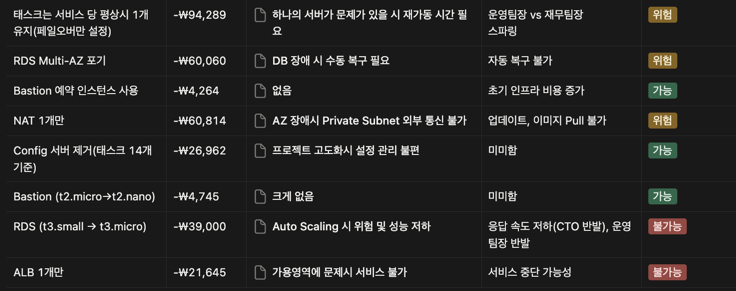

# ARCHITECTURE_DESIGN

## 기술 요구사항 분석

### 운영팀장 요구사항

> 장애 발생 시 자동 복구

- **계획**
    - fargate + 최소 보장 count 설정, ECS 헬스체크 사용해서 서비스 중단시 자동으로 재실행하도록 보장
    - DB에 문제가 생겨 standby DB가 primary로 승격 되는 시간 총 1분 ~ 2분
    - 배포는 블루그린 무중단 사용

- **운영팀장 요구사항 반영**
  > 장애가 새벽시간에 발생해도 인력 투입 없이 자동으로 회복하고 이 과정에서 서비스 중단을 최소화 할 방안을 마련했습니다.  
  항상 최소 2개 이상의 서비스를 활성화 상태로 유지하도록 설정했고 새로운 버전이 배포 되더라도 해당 과정이 중단 없이 이루어질 수 있도록 설정했습니다. 
  하지만 현재 기술적인 상황상 DB에 문제가 생기면 기존 DB를 대체할 복제 DB를 연결하는데 일부 서비스 중단이 발생하지만 모든 과정은 자동으로 이루어집니다.

### 비즈니스팀장 요구사항

> 블프(급증 예상 트래픽) 대비, 고객사 확장 대비
> - 수평 확장(수동 or 오토 스케일링)
> - 장기적 효율성과 안정성

- **계획**
    - 점진적으로 적용해 나갈 예정
    - 블프대비
        - 우선은 수동으로 증설하는 구조, 추후 메트릭 수집 후 오토 스케일링 적용 예정
        - 오전에는 보수적인 예측량으로 미리 일부 증설
        - 이후 예상 밖의 트래픽은 트리거에 의한 스케일링이 이루어지도록 계획
        - 요청 큐 기반 트리거로 스케일링
        - 안정성을 위해 최소 2개, 증설 이후 추가 발생할 트래픽까지 최대 6개까지 태스크를 확장

    - 고객사 확장 대비
        - 장기적인 효율성과 안정성 확보가 목표
        - API단 성능개선 (캐시 등) 활용
            - 캐시서버 인스턴스는 측정한 데이터로 설정
        - ReadOnly 레플리카 수 증설(조회 전용 DB로 변경)
        - 모니터링 결과에 따라 최소 유지하는 태스크 수 증설

- **비즈니스팀장 요구사항 반영**
  > 접속자가 갑자기 몰리는 시기나 고객사가 늘어나는 상황을 대비해, 서비스가 멈추지 않도록 확장 전략을 준비했습니다.
  우선, 현재 예상되는 트래픽 수준에서는 서비스 개수를 운영팀에서 즉시 늘릴 수 있도록 구성했습니다. 예를 들어 블랙프라이데이와 같이 방문이 급격히 증가하는 날에는, 미리 서비스를 일정 수준까지 늘려두고 이후
  예상보다 더 많은 요청이 들어오면 자동으로 추가 운영이 가능하도록 단계별 확장을 준비했습니다.
  또한 고객사가 장기적으로 증가하더라도 서버만 계속 늘리는 방식이 아니라, 조회만 처리하는 전용 데이터베이스와 캐시 기술 등을 함께 적용해 한 번 늘린 설비가 오래 유지되도록 구성했습니다. 이를 통해 단순히 서버
  숫자를 늘리는 방식이 아니라, 비용을 불필요하게 쓰지 않으면서 지속적으로 확장 가능한 구조를 마련했습니다.

### 보안팀장 요구사항

> 애플리케이션 및 네트워크 보안 강화
> - DB 외부 노출 제한
> - AWS 콘솔 및 네트워크 접근 권한 제어
> - 모든 작업 로그 기록
> - 애플리케이션 권한 제어

- **계획**
    - 서브넷별 SG 설정으로 단계적 권한 제어
    - IAM 사용자 권한으로 일부 작업 제한
    - Bastion을 통한 연결만 가능하도록 private subnet에 DB 격리
    - DB 사용자별 권한 제어

- **예상 보안 시나리오**
    - 외부에서 DB 접근 시도 -> Bastion 서버를 통하지 않으면 프라이빗 서브넷에 접근할 수 없어 연결이 차단됨
    - IAM 사용자 계정 하나가 해킹당해 배포 설정 수정을 시도 -> 권한을 최소한으로 부여하여 해당 계정으로 수행할 수 없는 작업 요청시 제한 발생
    - DB로의 접근까지 성공 -> 사용자별 권한을 분리하여 쓰기 권한이 없는 사용자로는 수정,삭제,삽입 요청이 거부됨

- **보안팀장 요구사항 반영**
  > 시스템을 외부에서 직접 접근할 수 없도록 구성해 데이터베이스는 내부망에만 위치시키고, 필요한 경우에만 Bastion 서버를 통해서만 접속할 수 있도록 제한했습니다.
  또한, AWS 계정에 과도한 권한을 부여하지 않고 각 담당 업무에 필요한 최소 권한만 부여하여 보안 사고 발생 시 피해를 최소화하도록 설정했습니다.
  마지막으로, 데이터베이스 접근 시에는 사용자별 권한을 분리해 단순 조회만 필요한 계정으로는 수정이나 삭제가 불가능하게 구성해 데이터 변조 위험을 줄였습니다.

### 재무팀장 요구사항

> 인프라 월 비용 통제 (15만원 선)
> - 리소스 최적화
> - 운영 인프라 비용 절감

#### AWS 비용

- ALB비용
  > 1 로드 밸런서 x 1 LCU x 0.008 시간당 LCU 가격 x 730 월별 시간 = **18.67 USD** 
  > 2 로드 밸런서 x 1 LCU x 0.008 시간당 LCU 가격 x 730 월별 시간 = **38.92 USD**

- ECS Task(24시간, 태스크당 0.25 vCPU, 0.5 mem, 임시 스토리지20)
  > 1개당 월간 **10.35 USD**

- RDS (예약 인스턴스 기준)
  > t3.small (Multi AZ), 전부 선결제 = 월간 **59.3 USD**  
  t3.small (Multi AZ) 예약 인스턴스지만 매달 결제 = 월간 **91.11 USD**  
  t3.micro (Multi AZ) = 월간 **29.6 USD**  
  t3.small (Single) = 월간 **13.1 USD**

- Elastic Cache(t2.micro, vCPU 1, 0.555 mem, low to moderate)
  > 온디맨드 = **월간 18.25 USD** 
  예약 인스턴스 = 월간 **8.76 USD**

- 라우트 53(호스팅 영역 1, 표준쿼리 월 300만)
  > 월간 **1.7 UDS**

- NAT Gateway (월별 아웃바운드 처리량 1GB, 공인아이피 1개 기준)
  > 1개당 월간 **46.78 USD**

- Bastion EC2
  > t3a.small 예약 인스턴스 = 월간 **11.9 USD** 
  t2.nano = 월간 **5.26 USD**

#### 절감 방안 

#### 최종 제안  

**플랜 1** (높은 고가용성, 안정적 성능, 급증 트래픽 대비) [468,767원]
> - ALB 2개
> - Bastion t2.micro 온디맨드
> - 태스크 서비스당 2개 유지(14개)
> - RDS t3.small (Multi-AZ) 온디맨드
> - NAT 2개()
> - 클라우드 와치
> - Elastic Cache t2.micro 온디맨드

**플랜 2** (일부 고가용성, 다소 안정적 성능, 급증 트래픽 일부 대비, 일부 요금 1년치 선결제) [369,0966원]
> - ALB 2개
> - Bastion t2.micro 예약 인스턴스 (1년)
> - Config 서버 삭제
> - 태스크 서비스당 2개 유지(12개)
> - RDS t3.small (Multi-AZ) 예약 인스턴스 (1년)
> - NAT 1개
> - 클라우드 와치
> - Elastic Cache t2.micro 예약 인스턴스 (1년)

**플랜 3** (고가용성 미확보, 불안정한 성능, 급증 트래픽 대비 거의불가, 일부 요금 1년치 선결제) [₩263,718]
> - ALB 1개
> - Bastion t2.nano 예약 인스턴스(1년)
> - Config 서버 삭제
> - 태스크 서비스당 1개 유지(6개)
> - RDS t3.small (Multi-AZ) 예약 인스턴스 (1년)
> - NAT 1개
> - 클라우드 와치
> - Elastic Cache t2.micro 예약 인스턴스 (1년)

- **최종안** (높은 고가용성, 안정적 성능, 급증 트래픽 대비) [425,750원]

> - ALB 1개 (18.67 USD)
> - Bastion t2.nano 온디맨드 (5.26 USD)
> - 태스크 서비스당 2개 유지(12개) (124.35 USD)
> - RDS t3.small (Multi-AZ) 온디맨드 (109.36 USD)
> - NAT 1개 (43.13 USD)
> - 클라우드 와치 (7.65 USD)
> - Elastic Cache t2.micro 온디맨드 (18.98 USD)

#### **재무팀장 요구사항 반영**

> 비용을 과도하게 억누르면 서비스 안정성이 떨어져 장애 발생 시 오히려 손실이 커질 가능성이 있어, 핵심 서비스에만 최소한의 비용을 투자하는 방향으로 조정했습니다.
> 수익이 아직 본격적으로 발생하지 않는 초기 단계임을 고려해, 당장의 부담이 큰 1년 선결제 방식은 제외하고 월 단위 요금 중심으로 구성했습니다. 대신, 서비스 품질에 직접적인 영향을 주지 않는 구성 요소는 사양을
> 낮추거나 일부 고가용성을 포기해 비용을 줄였습니다. (config서버 삭제, NAT 고가용성 포기)  
> 초기에는 인프라 비용 비중이 커 보이지만, 고객사가 증가할수록 일부 항목만 확장해도 전체 구조는 그대로 활용할 수 있기 때문에 향후 6개월 이후에는 매출 대비 인프라 비용 비율이 절반 수준까지 자연스럽게 감소할
> 수
> 있는 구조입니다. 이는 단순한 비용 지출이 아니라 장기적으로 수익성을 확보하기 위한 최소 수준의 투자 전략입니다. 개발팀에서 최선이라고 판단한 최종안의 비용이 너무 과하다면 다른 플랜들도 고려 가능합니다. 하지만
> 다른 플랜의 경우 비용은 절감되지만 SLA 미준수로 매월 위약금이 발생하는 등 일부 문제가 발생할 수 있습니다.

CTO
> API 응답 지연 최소화

- **계획**
    - 캐싱 활용
    - 병목 구간 해결
    - 네트워크 지연 해소
    - 쿼리 최적화
    - 애플리케이션 코드 최적화

- **CTO 요구사항 반영**
  > SLA 기준을 충족시키기 위해 단순 평균 응답속도 개선뿐만 아니라, 지연이 발생하는 최상위 5% 구간 병목을 집중적으로 제거하는 방향으로 구성했습니다.
  > 캐싱과 쿼리 최적화를 통해 평균 응답속도를 개선하고, 요청량이 몰릴 때 성능이 급격히 저하되지 않도록 비동기 I/O,
  > 커넥션 풀 튜닝 등을 병행해 병목 완화를 목표로 설정했습니다.
  > 단일 구간 개선이 아닌, DB → 네트워크 → 애플리케이션 → 캐싱 계층까지 전체 체인에서 1초 목표를 보장하도록 접근해 SLA 대응력을 확보하도록 계획을 수립했습니다.

