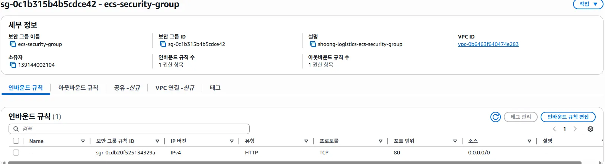
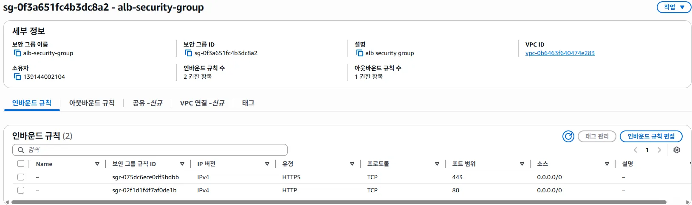
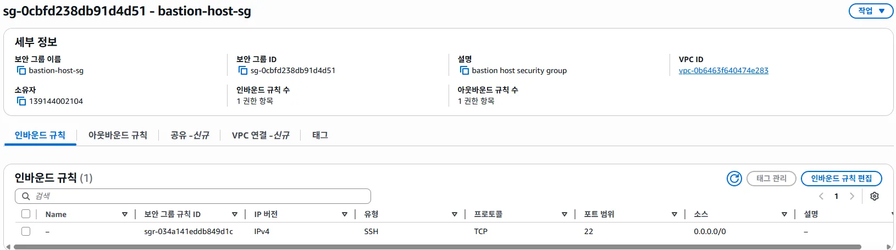
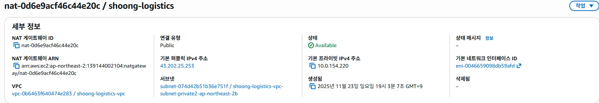
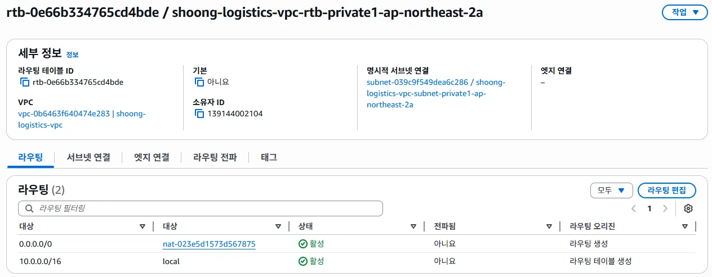
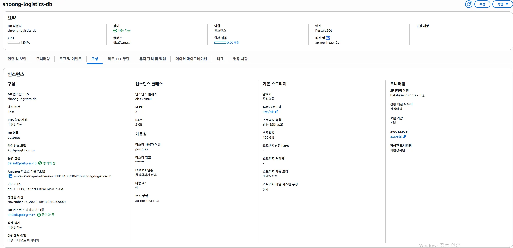
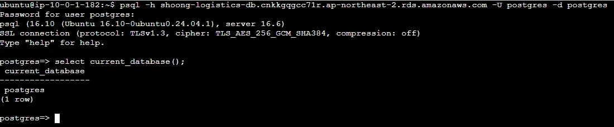
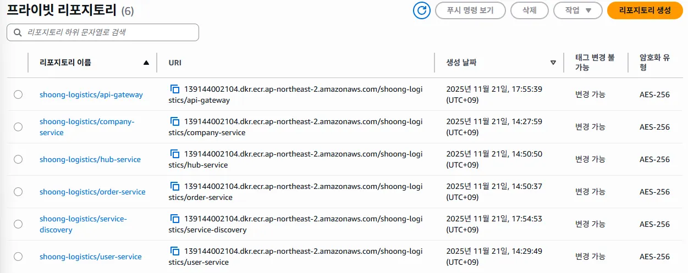
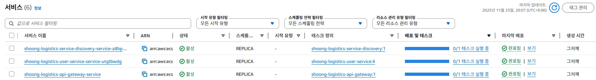
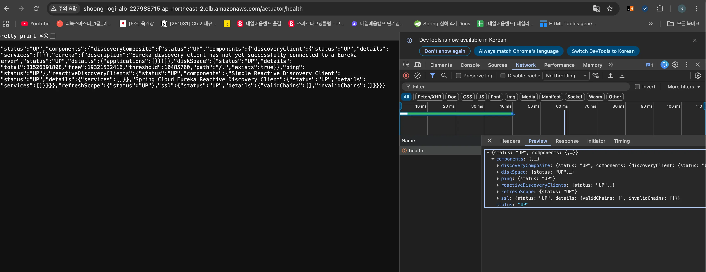

# DEPLOYMENT REPORT

### VPC

가용지역을 2개로 나눠 총 퍼블릭 서브넷 2개, 프라이빗 서브넷 4개 생성
퍼블릭 서브넷에 로드밸런서와 NAT가 위치하며 프라이빗 서브넷은 ECS 2개, DB와 REDIS 각 1개씩 사용합니다.

### Security Group

네트워크 구성상 바로 앞단의 트래픽만 받을 수 있도록 보안그룹을 구성

ALB를 통해 HTTP 트래픽을 전달받을 수 있도록 80번 포트만 접근을 허용

인터넷을 통한 트래픽을 받을 수 있도록 ALB는 80,443 포트로만 접근을 허용

프라이빗 서브넷에 위치한 인스턴스들에 접속할 수 있는 유일한 통로인 bastion 인스턴스는 ssh 22번 포트만을 허용

### NAT Gateway

아웃바운드 트래픽을 인터넷으로 내보낼 NAT 운영

NAT 활성화 상태

프라이빗 서브넷에 NAT 라우팅 등록

### RDS

Multi AZ로 구성

### Bastion

SSH연결로 접속해 vpc에 위치한 프라이빗 서브넷 인스턴스들 중 일부에 접근

bastion을 통해 RDS에 접속 성공한 상태

### ECR 이미지 목록

배포에 사용할 이미지는 Dockerfile로 작성하여 ECR에 등록 후 사용.
ECS에 task를 등록하여 서비스를 컨테이너 기반으로 운영

ECR 이미지 목록

ECS 서비스 목록

### API 동작

기능을 동작시키는 것 자체는 실패했지만 ALB -> Gateway로의 연결까지는 확인

