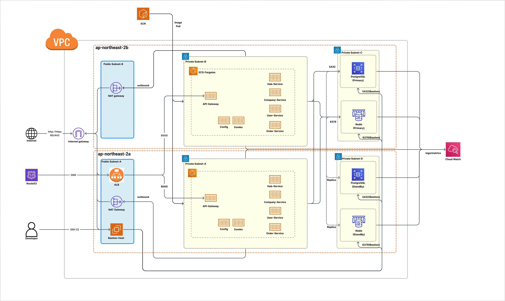
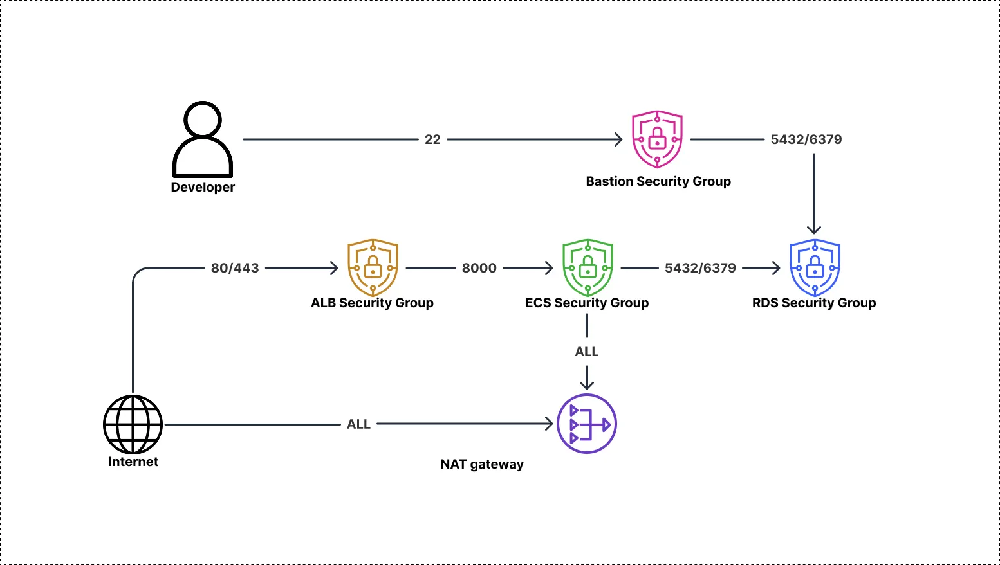

## 1. 아키텍처 개요

- ALB는 인터넷 게이트웨이를 통해 들어온 트래픽을 프라이빗 서브넷에 있는 ECS fargate로 전달
- ECS에서는 실제 비즈니스 로직을 처리
- RDS, Elastic Cache에 데이터 저장
- 프라이빗 서브넷에서 인터넷으로 나가는 요청은 NAT를 통해 공인 ip로 변환하여 통신
- 전용 SSH 호스트인 bastion을 만들고 이를 통해 외부에선 접근할 수 없게 설계된 내부망 인스턴스에 접근
- ECS배포에 사용할 이미지를 ECR에 등록하여 사용

## 2. 네트워크 보안

인터넷 요청을 받아야 하는 요소들만 퍼블릭 서브넷에 배치, 보호해야할 요소들은 프라이빗 서브넷에 배치하여 내부 인스턴스들을 외부에서 함부로 접근하기 어렵도록 설계. 프라이빗 서브넷도 서브넷별 작업을 제한하기 위해
서비스,스토리지로 나눠서 세분화

서브넷마다 보안그룹을 설정하여 네트워크 계층의 방어 전략 수립. 각 서브넷은 이전 단계 서브넷의 요청만 받을 수 있도록 제한

- ALB는 외부로부터의 HTTP, HTTPS 요청만 받을 수 있도록 80,443 인바운드 설정
- 내부 리소스 접근용 bastion은 SSH 요청만 받을 수 있도록 22 인바운드 설정
- ECS는 8000번 포트 요청만 받을 수 있도록 인바운드 설정
- RDS는 5432, Redis는 6379 포트 요청만 받을 수 있도록 인바운드 설정
- 내부 프라이빗 서브넷에서 외부로 나가는 아웃바운드 트래픽은 NAT를 거치도록 설정

DB는 프라이빗 서브넷에 격리하여 외부에서 바로 접근이 불가능하도록 운영하고 사용자별 권한을 세분화 하여 보안을 강화함. 이에 접근하기 위해서는 먼저 bastion에 ssh보안연결을 하고 이후 DB사용자 인증을
거쳐야 DB에 접근이 가능하며 접근하더라도 제한된 권한에 의한 작업만 일부 가능함.

## 3. 데이터 보안

Multi AZ설정으로 한 가용영역에 물리적인 문제가 발생하더라도 서비스가 자동으로 회복할 수 있게 설정. Primary-Standby 구조로 Primary 장애 발생시 이를 복제하고 있던 standby DB가
승격하여 Primary로 동작, 트래픽을 수신함

## 4. 접근 제어

IAM 사용자에게 목적에 맞는 최소한의 권한만 부여하여 일부 계정이 해킹되거나 잘못된 작업을 수행하려 시도했을 때 이를 적절히 차단할 수 있도록 관리.

Bastion Host에 SSH연결하고 이후 프라이빗 서브넷에 격리된 DB에 접근할 수 있도록 설계했고 이후에도 DB 사용자 인증 및 권한 분리로 DB접근을 제어.

## 5. 고가용성 및 재해 복구

NAT를 제외한 ECS, RDS, Cache 전부 Multi AZ를 적용하여 한 가용지역에 물리적 장애가 발생하더라도 다른 가용지역에서 실행중인 서비스가 이를 즉시 대체할 수 있도록 설계.
NAT의 경우 초기 비용 절감을 위해 Multi AZ를 적용하지 않았고 이는 수익성이 개선되면 고가용성을 확보할 계획.

fargate로 실행중인 ECS Task는 actuator/health에 요청을 보내 주기적으로 컨테이너가 정상 동작하는지를 체크하고 최소 태스크 실행 수를 보장하여 컨테이너에 장애가 발생하더라도 자동으로 최소 실행
수 만큼 실행될 수 있도록 재실행을 시도.

RDS의 경우도 Multi AZ를 적용하고 Primary와 복제본인 Standby 2개의 DB를 운영하여 DB 장애 발생 시 자동으로 StandBy를 Primary로 승격하거나 복구하도록 설계.

